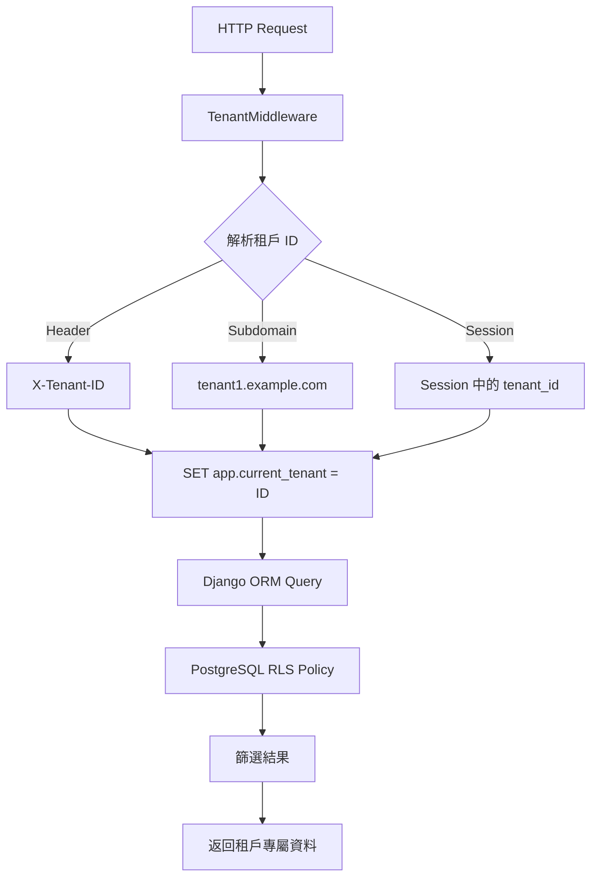

# PostgreSQL Row Level Security (RLS) 多租戶隔離完整指南

## 📋 目錄

1. [RLS 概念介紹](#rls-概念介紹)
2. [為什麼選擇 RLS](#為什麼選擇-rls)
3. [架構設計](#架構設計)
4. [實現原理](#實現原理)
5. [程式碼說明](#程式碼說明)
6. [測試驗證](#測試驗證)
7. [最佳實踐](#最佳實踐)
8. [故障排除](#故障排除)
9. [性能考量](#性能考量)
10. [安全考量](#安全考量)

## RLS 概念介紹

### 什麼是 Row Level Security (RLS)？

Row Level Security (RLS) 是 PostgreSQL 提供的一種資料庫層級的安全功能，它允許您在表的每一行上套用存取控制政策。與傳統的表級別或列級別權限不同，RLS 可以根據特定條件限制用戶對特定行的存取。

### 核心概念

```sql
-- 啟用 RLS
ALTER TABLE table_name ENABLE ROW LEVEL SECURITY;

-- 建立政策
CREATE POLICY policy_name ON table_name
FOR ALL TO role_name
USING (condition);
```

### RLS vs 傳統權限

| 特性       | 傳統權限         | RLS            |
| ---------- | ---------------- | -------------- |
| 控制粒度   | 表/列級別        | 行級別         |
| 多租戶支援 | 需要複雜查詢     | 透明隔離       |
| 安全性     | 應用程式負責     | 資料庫強制執行 |
| 性能       | 依賴應用程式實現 | 資料庫最佳化   |

## 為什麼選擇 RLS？

### 1. 資料庫層級安全

- **強制執行**: 無法透過 SQL 繞過，即使是直接連接資料庫
- **零信任**: 不依賴應用程式邏輯的正確性
- **審計**: 所有存取都經過資料庫記錄

### 2. 多租戶隔離

- **透明**: 應用程式無需修改查詢邏輯
- **完整**: 包含 SELECT、INSERT、UPDATE、DELETE 所有操作
- **效能**: 資料庫引擎最佳化

### 3. 降低複雜性

```python
# 傳統方式 - 每個查詢都需要加入租戶篩選
def get_products(tenant_id):
    return Product.objects.filter(tenant_id=tenant_id)

# RLS 方式 - 透明隔離
def get_products():
    return Product.objects.all()  # 自動只返回當前租戶的資料
```

## 架構設計

### 系統架構圖

```
┌─────────────────────────────────────────────────────────┐
│                    Django Application                   │
├─────────────────────────────────────────────────────────┤
│  ┌──────────────────┐  ┌──────────────────────────────┐ │
│  │   HTTP Request   │  │      TenantMiddleware        │ │
│  │   (X-Tenant-ID)  │  │  - 解析租戶 ID               │ │
│  │                  │  │  - 設定資料庫上下文          │ │
│  └──────────────────┘  └──────────────────────────────┘ │
├─────────────────────────────────────────────────────────┤
│  ┌─────────────────────────────────────────────────────┐ │
│  │                Django ORM                           │ │
│  │  - 透明查詢 (不需要修改)                           │ │
│  │  - 自動套用租戶篩選                                │ │
│  └─────────────────────────────────────────────────────┘ │
├─────────────────────────────────────────────────────────┤
│  ┌─────────────────────────────────────────────────────┐ │
│  │               PostgreSQL Database                   │ │
│  │  ┌─────────────────┐  ┌─────────────────────────────┐ │ │
│  │  │   Connection    │  │        RLS Policies         │ │ │
│  │  │   Context       │  │  - tenant_policy            │ │ │
│  │  │ app.current_    │  │  - admin_policy             │ │ │
│  │  │ tenant = X      │  │  - 自動套用隔離條件         │ │ │
│  │  └─────────────────┘  └─────────────────────────────┘ │ │
│  └─────────────────────────────────────────────────────┘ │
└─────────────────────────────────────────────────────────┘
```

### 資料流程



## 實現原理

### 1. 資料庫設定

#### 用戶和角色設定

```sql
-- 建立應用程式用戶
CREATE USER app_user WITH PASSWORD 'app_pass';
CREATE ROLE app_role;
GRANT app_role TO app_user;

-- 權限設定
GRANT USAGE ON SCHEMA public TO app_role;
GRANT CREATE ON SCHEMA public TO app_role;
ALTER DEFAULT PRIVILEGES IN SCHEMA public
GRANT SELECT, INSERT, UPDATE, DELETE ON TABLES TO app_role;
```

#### RLS 政策設定

```sql
-- 啟用 RLS
ALTER TABLE tenants_product ENABLE ROW LEVEL SECURITY;
ALTER TABLE tenants_product FORCE ROW LEVEL SECURITY;

-- 建立租戶政策
CREATE POLICY tenant_policy ON tenants_product
FOR ALL
USING (
    tenant_id = COALESCE(
        NULLIF(current_setting('app.current_tenant', true), ''),
        '0'
    )::int
    AND tenant_id > 0
);
```

### 2. Django 整合

#### 模型設計

```python
class TenantAwareModel(models.Model):
    """所有需要租戶隔離的模型的基類"""
    tenant_id = models.IntegerField(db_index=True)

    class Meta:
        abstract = True

    def save(self, *args, **kwargs):
        # 自動設定 tenant_id
        if not self.tenant_id:
            try:
                with connection.cursor() as cursor:
                    cursor.execute("SELECT current_setting('app.current_tenant', true)")
                    result = cursor.fetchone()
                    if result and result[0]:
                        self.tenant_id = int(result[0])
            except:
                pass
        super().save(*args, **kwargs)

class Product(TenantAwareModel):
    name = models.CharField(max_length=200)
    price = models.DecimalField(max_digits=10, decimal_places=2)
    # tenant_id 由 TenantAwareModel 提供
```

#### middleware 實現

```python
class TenantMiddleware(MiddlewareMixin):
    def process_request(self, request):
        # 重設租戶上下文
        with connection.cursor() as cursor:
            cursor.execute("RESET app.current_tenant")

        # 取得租戶 ID
        tenant_id = self._get_tenant_id(request)

        if tenant_id:
            # 驗證租戶存在且 active
            if not Tenant.objects.filter(id=tenant_id, is_active=True).exists():
                return JsonResponse({'error': '無效的租戶'}, status=403)

            # 設定租戶上下文
            with connection.cursor() as cursor:
                cursor.execute("SET app.current_tenant = %s", [tenant_id])

            request.tenant_id = tenant_id

    def _get_tenant_id(self, request):
        # 1. 從 Header 取得
        tenant_id = request.META.get('HTTP_X_TENANT_ID')
        if tenant_id:
            return tenant_id

        # 2. 從 subdomain 取得
        host = request.get_host()
        subdomain = host.split('.')[0]
        if subdomain != 'www' and subdomain != host:
            try:
                tenant = Tenant.objects.get(subdomain=subdomain, is_active=True)
                return tenant.id
            except Tenant.DoesNotExist:
                pass

        # 3. 從 session 取得
        return request.session.get('tenant_id')
```

### 3. RLS policy

#### 基本政策

```sql
-- 租戶政策：只允許存取當前租戶的資料
CREATE POLICY tenant_policy ON tenants_product
FOR ALL
USING (
    tenant_id = COALESCE(
        NULLIF(current_setting('app.current_tenant', true), ''),
        '0'  -- 預設為 0，確保沒有設定時無法存取任何資料
    )::int
    AND tenant_id > 0  -- 防止負數或零值
);
```

#### 管理員政策

```sql
-- 管理員政策：同樣遵循租戶隔離
CREATE POLICY admin_policy ON tenants_product
FOR ALL
TO app_role
USING (
    tenant_id = COALESCE(
        NULLIF(current_setting('app.current_tenant', true), ''),
        '0'
    )::int
    AND tenant_id > 0
);
```

#### 政策組合邏輯

```sql
-- 政策條件分析
COALESCE(
    NULLIF(current_setting('app.current_tenant', true), ''),
    '0'
)::int

-- 步驟分解：
-- 1. current_setting('app.current_tenant', true) -> 取得設定值
-- 2. NULLIF(..., '') -> 如果是空字串則返回 NULL
-- 3. COALESCE(..., '0') -> 如果是 NULL 則使用 '0'
-- 4. ::int -> 轉換為整數
-- 5. AND tenant_id > 0 -> 確保只有正數 tenant_id 通過
```

## 程式碼說明

### 1. Migration 文件

```python
# tenants/migrations/0002_enable_rls.py
from django.db import migrations

class Migration(migrations.Migration):
    dependencies = [
        ('tenants', '0001_initial'),
    ]

    operations = [
        migrations.RunSQL(
            sql="""
            -- 啟用 RLS
            ALTER TABLE tenants_product ENABLE ROW LEVEL SECURITY;
            ALTER TABLE tenants_product FORCE ROW LEVEL SECURITY;

            -- 租戶政策
            CREATE POLICY tenant_policy ON tenants_product
            FOR ALL
            USING (
                tenant_id = COALESCE(
                    NULLIF(current_setting('app.current_tenant', true), ''),
                    '0'
                )::int
                AND tenant_id > 0
            );

            -- 權限設定
            REVOKE ALL ON tenants_product FROM PUBLIC;
            GRANT SELECT, INSERT, UPDATE, DELETE ON tenants_product TO app_role;
            """,
            reverse_sql="""
            DROP POLICY IF EXISTS tenant_policy ON tenants_product;
            ALTER TABLE tenants_product DISABLE ROW LEVEL SECURITY;
            GRANT ALL ON tenants_product TO PUBLIC;
            """
        )
    ]
```

### 2. 模型設計

```python
# tenants/models.py
from django.db import models, connection
from django.core.exceptions import ValidationError
import uuid

class Tenant(models.Model):
    name = models.CharField(max_length=100)
    subdomain = models.CharField(max_length=50, unique=True)
    is_active = models.BooleanField(default=True)
    created_at = models.DateTimeField(auto_now_add=True)

    def __str__(self):
        return self.name

class TenantAwareModel(models.Model):
    """所有需要租戶隔離的模型的基類"""
    tenant_id = models.IntegerField(db_index=True)

    class Meta:
        abstract = True

    def clean(self):
        # 驗證 tenant_id
        if self.tenant_id and self.tenant_id <= 0:
            raise ValidationError('租戶 ID 必須是正數')

        # 驗證租戶存在且 active
        if self.tenant_id:
            if not Tenant.objects.filter(id=self.tenant_id, is_active=True).exists():
                raise ValidationError('無效的租戶')

    def save(self, *args, **kwargs):
        # 自動設定 tenant_id
        if not self.tenant_id:
            try:
                with connection.cursor() as cursor:
                    cursor.execute("SELECT current_setting('app.current_tenant', true)")
                    result = cursor.fetchone()
                    if result and result[0]:
                        self.tenant_id = int(result[0])
            except:
                pass

        self.full_clean()
        super().save(*args, **kwargs)

class Product(TenantAwareModel):
    id = models.UUIDField(primary_key=True, default=uuid.uuid4)
    name = models.CharField(max_length=200)
    price = models.DecimalField(max_digits=10, decimal_places=2)
    description = models.TextField(blank=True)
    created_at = models.DateTimeField(auto_now_add=True)

    class Meta:
        indexes = [
            models.Index(fields=['tenant_id']),
            models.Index(fields=['tenant_id', 'name']),
        ]
        unique_together = ['tenant_id', 'name']

    def __str__(self):
        return self.name
```

### 3. middleware 實現

```python
# tenants/middleware.py
from django.utils.deprecation import MiddlewareMixin
from django.db import connection
from django.http import JsonResponse
from django.contrib.auth.models import AnonymousUser
from .models import Tenant
import logging

logger = logging.getLogger(__name__)

class TenantMiddleware(MiddlewareMixin):
    def process_request(self, request):
        # 重設租戶上下文
        try:
            with connection.cursor() as cursor:
                cursor.execute("RESET app.current_tenant")
        except Exception as e:
            logger.error(f"Failed to reset tenant context: {e}")
            return JsonResponse({'error': '系統錯誤'}, status=500)

        # 取得租戶 ID
        tenant_id = self._get_tenant_id(request)

        if tenant_id:
            try:
                tenant_id = int(tenant_id)

                # 驗證租戶存在且 active
                if not Tenant.objects.filter(id=tenant_id, is_active=True).exists():
                    logger.warning(f"Invalid tenant access attempt: {tenant_id}")
                    return JsonResponse({'error': '無效的租戶'}, status=403)

                # 驗證用戶權限
                if not isinstance(request.user, AnonymousUser):
                    if hasattr(request.user, 'tenant') and request.user.tenant.id != tenant_id:
                        logger.warning(f"User {request.user.id} attempted to access tenant {tenant_id}")
                        return JsonResponse({'error': '無權存取此租戶'}, status=403)

                # 設定租戶上下文
                with connection.cursor() as cursor:
                    cursor.execute("SET app.current_tenant = %s", [tenant_id])

                request.tenant_id = tenant_id
                logger.info(f"Tenant context set: {tenant_id}")

            except (ValueError, TypeError) as e:
                logger.warning(f"Invalid tenant ID format: {tenant_id}")
                return JsonResponse({'error': '無效的租戶 ID'}, status=400)
        else:
            request.tenant_id = None
            # 對於需要租戶的 API 路徑
            if request.path.startswith('/api/'):
                return JsonResponse({'error': '缺少租戶資訊'}, status=400)

    def _get_tenant_id(self, request):
        # 1. 從 Header 取得 (API 使用)
        tenant_id = request.META.get('HTTP_X_TENANT_ID')
        if tenant_id:
            return tenant_id

        # 2. 從 subdomain 取得 (網頁使用)
        host = request.get_host()
        subdomain = host.split('.')[0]
        if subdomain != 'www' and subdomain != host:
            try:
                tenant = Tenant.objects.get(subdomain=subdomain, is_active=True)
                return tenant.id
            except Tenant.DoesNotExist:
                pass

        # 3. 從 session 取得 (後備方案)
        return request.session.get('tenant_id')

    def process_response(self, request, response):
        # 清理租戶上下文
        try:
            with connection.cursor() as cursor:
                cursor.execute("RESET app.current_tenant")
        except Exception as e:
            logger.error(f"Failed to reset tenant context in response: {e}")

        return response
```

## 測試驗證

### 1. 自動化測試

#### Django 管理命令

```bash
# 基本測試
python manage.py test_tenant_isolation

# 詳細測試
python manage.py test_tenant_isolation --verbose

# 清理測試資料
python manage.py test_tenant_isolation --cleanup
```

#### 獨立測試腳本

```bash
python test_tenant_isolation.py
```

### 2. SQL 直接測試

#### 執行 SQL 測試腳本

```bash
# 連接資料庫
psql -h localhost -p 5433 -U postgres -d rls_db

# 執行測試
\i test_rls.sql
```

#### 手動 SQL 測試

```sql
-- 1. 檢查 RLS 狀態
SELECT tablename, rowsecurity FROM pg_tables WHERE tablename = 'tenants_product';

-- 2. 測試無租戶上下文
SET ROLE app_user;
RESET app.current_tenant;
SELECT COUNT(*) FROM tenants_product; -- 應該是 0

-- 3. 測試租戶隔離
SET app.current_tenant = '1';
SELECT COUNT(*) FROM tenants_product; -- 只看到租戶1的資料

SET app.current_tenant = '2';
SELECT COUNT(*) FROM tenants_product; -- 只看到租戶2的資料

-- 4. 測試跨租戶防護
SET app.current_tenant = '1';
SELECT COUNT(*) FROM tenants_product WHERE tenant_id = 2; -- 應該是 0
```

### 3. 測試覆蓋範圍

✅ **基本隔離測試**

- 租戶只能看到自己的資料
- 無租戶上下文時無法存取資料

✅ **跨租戶防護測試**

- 在租戶 A 上下文中無法存取租戶 B 的資料
- 直接 SQL 查詢也被阻止

✅ **政策驗證測試**

- RLS 正確啟用
- 政策正確建立和套用

✅ **邊界條件測試**

- 無效租戶 ID 處理
- 負數租戶 ID 防護
- 空字串租戶 ID 處理

✅ **併發測試**

- 多執行緒環境下的隔離性
- 連線池中的上下文隔離

## 最佳實踐

### 1. 安全設計原則

#### 預設拒絕

```sql
-- 確保沒有租戶上下文時無法存取資料
CREATE POLICY tenant_policy ON tenants_product
FOR ALL
USING (
    tenant_id = COALESCE(
        NULLIF(current_setting('app.current_tenant', true), ''),
        '0'  -- 預設為 0，確保無法存取
    )::int
    AND tenant_id > 0  -- 額外防護
);
```

#### 最小權限原則

```sql
-- 撤銷公開權限
REVOKE ALL ON tenants_product FROM PUBLIC;

-- 只授予必要權限給應用程式角色
GRANT SELECT, INSERT, UPDATE, DELETE ON tenants_product TO app_role;
```

### 2. 性能最佳化

#### 索引設計

```python
class Product(TenantAwareModel):
    class Meta:
        indexes = [
            models.Index(fields=['tenant_id']),           # 基本租戶索引
            models.Index(fields=['tenant_id', 'name']),   # 複合索引
            models.Index(fields=['tenant_id', 'created_at']),  # 時間查詢
        ]
```

#### 連線管理

```python
# settings.py
DATABASES = {
    'default': {
        'ENGINE': 'django.db.backends.postgresql',
        'CONN_MAX_AGE': 0,  # 對於 RLS 重要：避免連線重用造成租戶洩漏
    }
}
```

### 3. 監控和日誌

#### middleware 日誌

```python
logger.info(f"Tenant context set: {tenant_id}, User: {request.user.id}")
logger.warning(f"Invalid tenant access attempt: {tenant_id}")
```

#### 資料庫日誌

```sql
-- 啟用查詢日誌
SET log_statement = 'all';
SET log_min_duration_statement = 0;
```

### 4. 開發工作流程

#### 1. 新增租戶感知模型

```python
class NewModel(TenantAwareModel):
    # 自動繼承 tenant_id 欄位
    name = models.CharField(max_length=100)

    class Meta:
        indexes = [
            models.Index(fields=['tenant_id']),
        ]
```

#### 2. 建立 RLS 政策

```python
# 在 migration 中加入
migrations.RunSQL(
    sql="""
    ALTER TABLE app_newmodel ENABLE ROW LEVEL SECURITY;
    ALTER TABLE app_newmodel FORCE ROW LEVEL SECURITY;

    CREATE POLICY tenant_policy ON app_newmodel
    FOR ALL
    USING (
        tenant_id = COALESCE(
            NULLIF(current_setting('app.current_tenant', true), ''),
            '0'
        )::int
        AND tenant_id > 0
    );
    """,
    reverse_sql="""
    DROP POLICY IF EXISTS tenant_policy ON app_newmodel;
    ALTER TABLE app_newmodel DISABLE ROW LEVEL SECURITY;
    """
)
```

#### 3. 測試新模型

```python
# 加入到測試腳本
def test_new_model_isolation(self):
    # 建立測試資料
    # 驗證隔離性
    pass
```

---

**相關文件：**

- [SQL 測試指南](SQL-test-tutorial.md)
- [租戶隔離測試指南](test-tenant-tutorial.md)
- [測試腳本](../tenants/management/commands/test_tenant_isolation.py)
- [SQL 測試腳本](../scripts/test_rls.sql)
